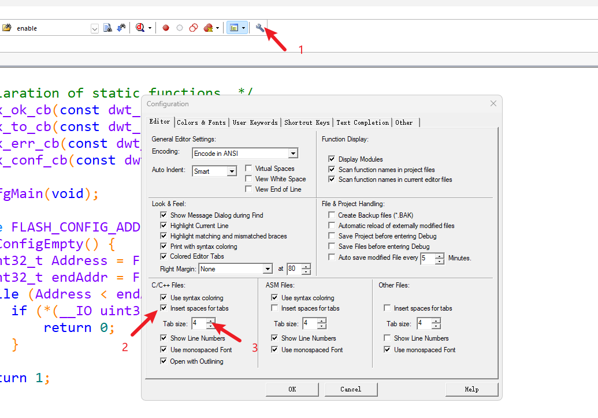
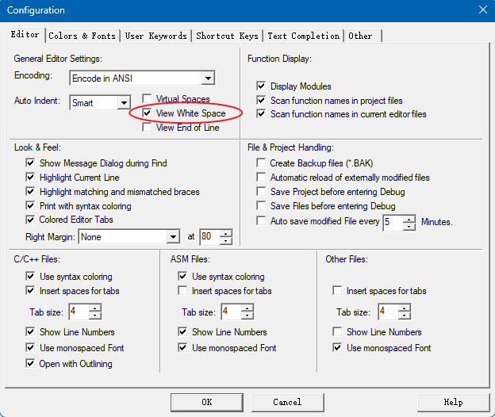
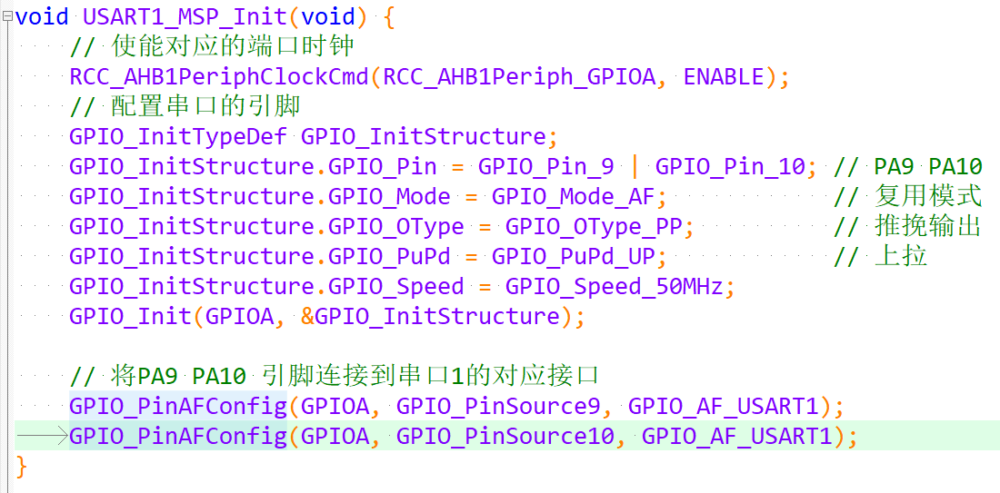

- 本文参考正点原子的《嵌入式单片机C代码规范与风格_V1.1》编写
- ## 第一章规范说明
  background-color:: red
	- 对于研究生期间所做的项目，建议遵循本文档的约束，规范代码编写和风格。工程的最终目的：统一风格、便于阅读、便于使用、便于移植和便于维护。
	- 代码规范需要做到以下几点
		- 简洁明了、清晰
		  logseq.order-list-type:: number
		  代码写出来重点是给人看的，简洁明了、清晰是第一要务！代码的可阅读性要高于代码的性能（除非代码已经完善并且以后也不需要维护，但这种情况几乎不存在）。简洁明了、清晰的代码也利于后期维护，尤其是当你写的代码交给其他人去维护的时候，请不要祸害其他人！
		- 精简
		  logseq.order-list-type:: number
		  代码越长越难懂，尽量把函数写的精简。代码越长越容易出错。没有用的代码、变量等一定要及时清理掉！功能类似或重复的代码应尽可能提炼成一个函数。
		- 保持第三方代码风格
		  logseq.order-list-type:: number
		  我们编写的项目代码必须做到风格统一，方便维护。如果使用了第三方代码（如HAL库、FATFS、emWIN、OS、Lwip以及各种Lib等），出现风格冲突，应用程序还是以本文规定的格式编写，与第三方代码的接口程序运行两种风格并存，切记不要去修改第三方代码风格（修改第三方代码风格，费时费力，当这些库更新时，之前的工作相当于白干，所以不要去修改第三方风格）
		- 减少封装
		  logseq.order-list-type:: number
		  切忌对第三方代码库进行再封装，不要为了让第三方代码和我们的风格统一 ，而去修改第三方源码风格或者重新写一套接口函数，以便和我们代码风格统一。为了统一而再次封装第三方代码会对后续项目交接、维护产生不利影响。保证项目传承、上手效率也是考虑的因素。
- ## 排版格式和注释
  background-color:: red
	- 排版是为了在编写代码的时候按照“一定的规矩”来编写，主要目的是为了代码清晰、易于阅读。注释顾名思义就是为自己的代码添加注释以方便他人的阅读（尤其是在维护过程中）。优美的排版和言简意赅的注释可以提高阅读者的阅读效率，所以在编写代码之前一定要确定好自己打算采用的排版方式和注释方式。
	- ### 排版格式
		- #### 代码缩进
		  collapsed:: true
			- 代码缩进要使用制表符，也就是`TAB`键。一般情况下一个`TAB`为4个字符，但也有8个字符甚至更多的情况，为了统一规范，我们统一规定：`TAB`键为4个字符。
			- 同时，我们规定：`TAB`键缩进空格代替。因为不同的编译器对`TAB`键的长度是不完全一样的，有可能导致看起来非常难看。最简单的方式是可以使用`记事本`打开项目里的源文件或头文件，就会发现和编译器有所不同；如果用空格键代码`TAB`缩进字符，则无论用什么软件打开看起来基本是一样的。
			- 对于MDK编辑器，可以通过下图所示设置`TAB`缩进用空格进行填充。
				- #+BEGIN_CENTER
				  {:height 17, :width 800}
				  #+END_CENTER
			- 还可以按照下图设置，勾选`View White Spaces`来查看所有的空格。
				- #+BEGIN_CENTER
				   
				  #+END_CENTER
			- 开启后的效果如下图所示，可以看到，显示空格的效果就跟Word里面一样，将空格用“·”符号显示出来。同时为了和`TAB`进行比较，我在最后一行代码（最后的大括号上面）输入了一个`TAB`，这个符号以一个右箭头的形式显示（也和Word里的一样）。
				- #+BEGIN_CENTER
				  
				  #+END_CENTER
				- 虽然上图里，`TAB`的缩进长度和4个空格一致，但是如果在其他编辑器上打开就有可能出现不一致的情况，最后导致代码看起来长短按不一，不对齐不好看。所以我们规定：代码缩进统一用`TAB`键对齐，`TAB`键设置为4个空格缩进代替。
		- #### 代码行相关规范
		  collapsed:: true
			- `if`、`for`、`do`、`while`、`case`、`swich`、`default` 等语句单独占用一行。且 `if`、`for`、`do`、`while` 等语句的执行语句部分无论多少都要加括号`{}`，当且仅当 `while` 后为空，可以不加`{}`。
			- 不规范的写法
				- ```C
				  if (p_gpiox->IDR & pinx) return 1; 	/* pinx 的状态为 1 */
				  else return 0; 						/* pinx 的状态为 0 */
				  ```
			- 应改为
				- ```C
				  if (p_gpiox->IDR & pinx){
				  	return 1; /* pinx 的状态为 1 */
				  }
				  else{
				   	return 0; /* pinx 的状态为 0 */
				  }
				  ```
		- ### 括号与空格
			- 代码中用到大括号的地方，采用Java风格
				- ```C
				  for (...) {
				  ... /* program code */
				  }
				  ```