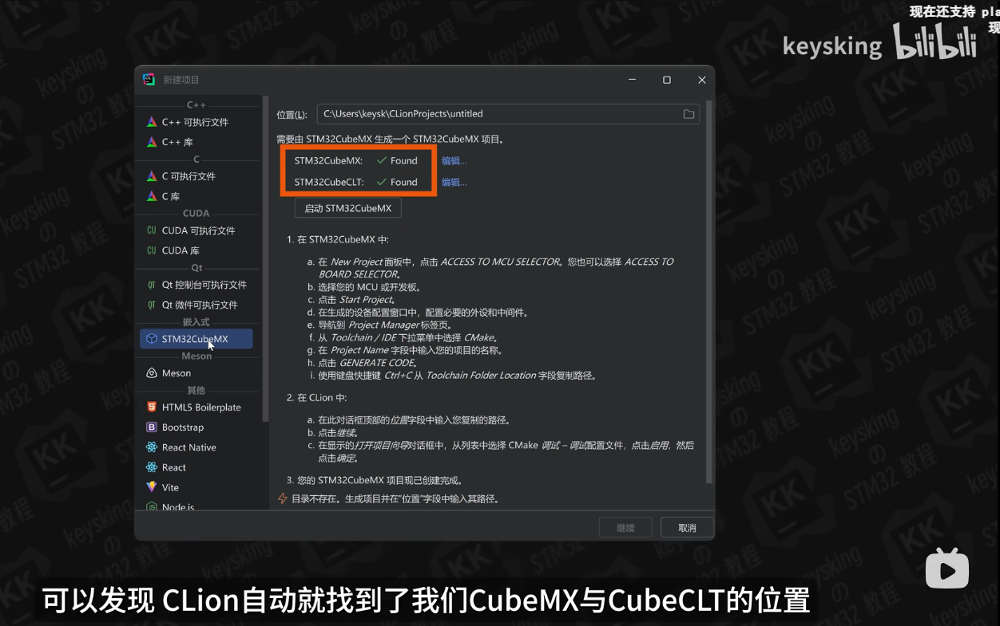
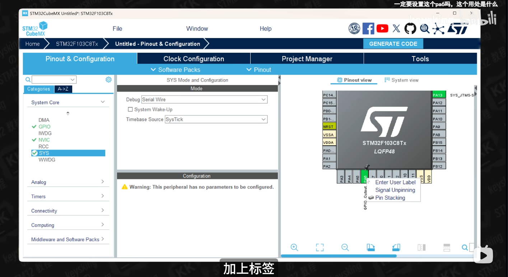
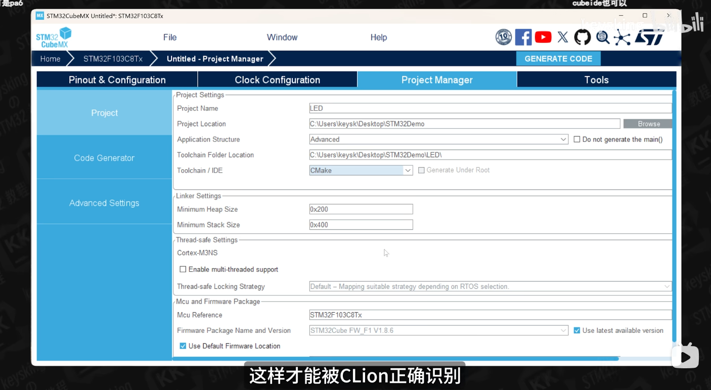
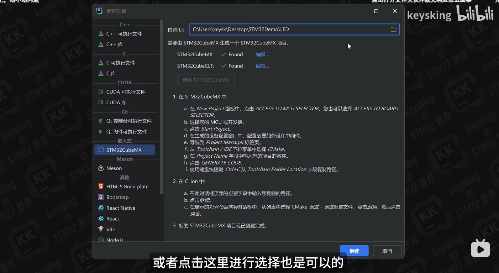
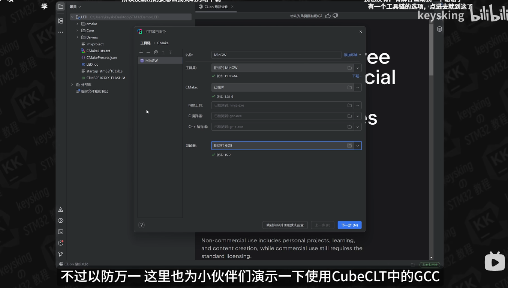
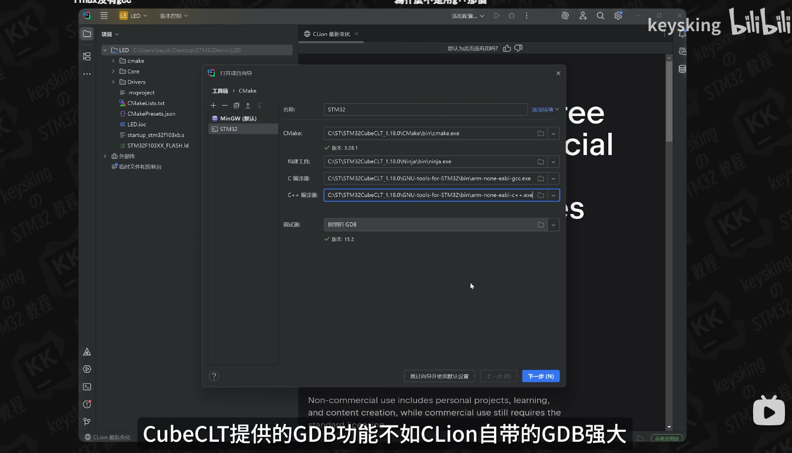
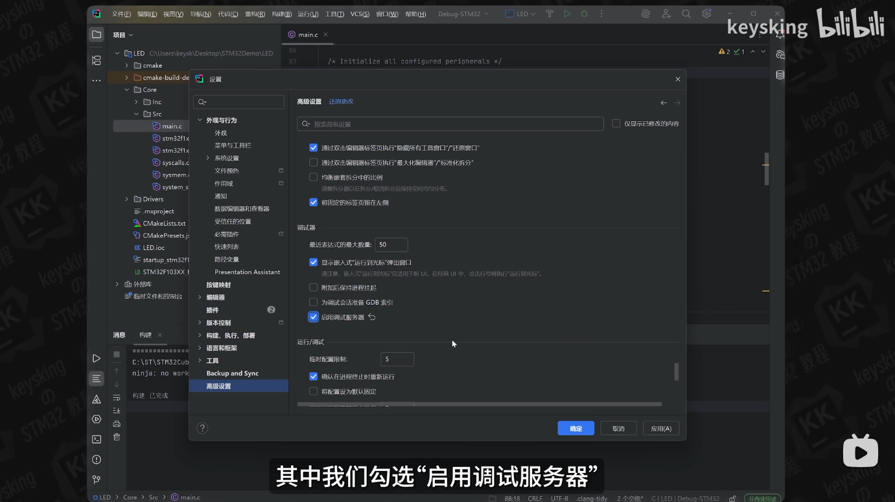

- > 原文链接：[爽！手把手教你用CLion开发STM32【大人，时代变啦！！！】](https://www.bilibili.com/video/BV1pnjizYEAk/?share_source=copy_web&vd_source=fd3aa3239988b4b363737fcb2a86087e)
- 嵌入式开发IDE：Keil、IAR和STM32CubeIDE。
- CLion现代化开发软件体验比上面三位前辈要好。
- 使用CLion进行嵌入式开发准备：
	- 代码IDE：在JetBrains官网下载CLion（非商业用途免费使用）
	- 代码生成工具：STM32CubeMX软件用于生成对应的STM32工程
	- 代码编译工具链：STM32CubeCLT(STM32CubeCommand Line Tools)开发工具链：
		- CMake
		- Arm-GCC
		- Ninja（构建工具，类似于Makefile）
		- STLink
- 创建工程流程：
	- 打开CLion创建一个嵌入式工程
	- #+BEGIN_CENTER
	  {:height 561, :width 812} 
	  #+END_CENTER
	-
- 打开STM32CubeMX创建一个STM32的简单工程作为示例。
- #+BEGIN_CENTER
  {:height 463, :width 796} 
  #+END_CENTER
- 要将工具链设置为CMake以便让CLion正确识别
- #+BEGIN_CENTER
  {:height 471, :width 811} 
  #+END_CENTER
- 在CLion中选择刚刚STM32CubeMX生成的工程的工程路径
- #+BEGIN_CENTER
  {:height 486, :width 823} 
  #+END_CENTER
- 第一次打开工程的时候会提示设置工具链，CLion自带的MinGW工具也可以进行STM32的程序编译，也可以使用STM32CubeCLT中的工具链，对于GDB调试器，推荐使用CLion自带的GDB调试器（效果好）
- #+BEGIN_CENTER
  {:height 487, :width 835} 
  {:height 616, :width 842} 
  #+END_CENTER
- 设置启用**调试服务器**
- #+BEGIN_CENTER
  {:height 497, :width 838}
  #+END_CENTER
-